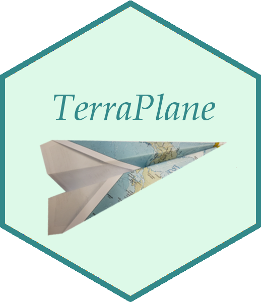

# TerraPlane



The TerraPlane suite is a collection of Shiny Based R apps to help investigators use the Terra analysis platform (https://app.terra.bio)

It consists of :
- TerraStation - provides an overview of a user’s current Terra resources
- TerraPlane - provides tools for importing, configuring, and running a Dockstore (https://dockstore.org/) based WDL workflow into Terra
- TerraShip - provides tools to run, monitor, and stop Terra workspace based workflows

```{r code}
devtools::install_github("shwetagopaul92/TerraPlane")
library(TerraPlane)
```

# TerraStation

Shiny App to help begin using Terra in R.

To start the App:

```{r code}
TerraPlane::runTerraStation()
```


# TerraPlane

Shiny App To help filter dockstore to find methods based on search term.

To start the App:

```{r code}
TerraPlane::runTerraPlane()
```

# TerraShip

Shiny App to help search, submit, monitor workflows on Terra.

To start the App:

```{r code}
TerraPlane::runTerraShip()
